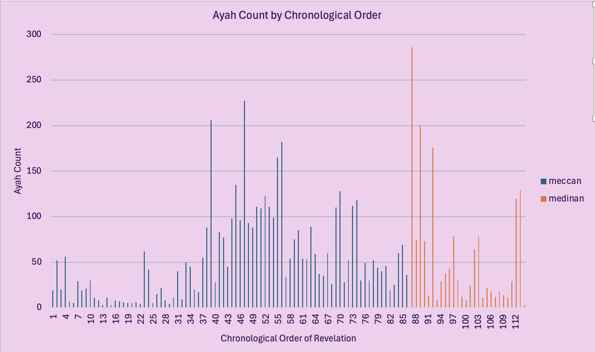

# Introduction
Explore the structure and language patterns of the Qur’an through interactive Excel dashboards. This project analyzes the distribution and length of Surahs, highlights frequently used words, and examines the chronological order of revelation. Using pivot tables, slicers, and dynamic visuals, the dashboard brings out patterns in word usage, Surah composition, and differences between Meccan and Medinan verses — offering a data-driven lens on one of the world’s most studied texts.

# Background
Driven by a passion for both data and religious texts, this project explores patterns within the Qur’an using Excel as a tool for analysis and visualization. The idea began with a simple question: What can we learn about the Qur’an’s structure and word usage through data? From there, it evolved into a fully interactive dashboard using pivot tables, slicers, and formulas to explore Surah length, word frequency, and the order of revelation.

The underlying data was structured around each word and verse, along with metadata such as Surah origin (Meccan or Medinan), length (by verses and word count), and chronological position. These elements were transformed into a dynamic dashboard, enabling rich exploration and insight extraction without writing a single line of code.

# Tools I Used
To build this interactive Quranic dashboard, I leveraged a set of Excel-based tools and features:

-**Microsoft Excel:** The primary tool used for data structuring, analysis, and dashboard creation.
-**Pivot Tables:** Enabled efficient data summarization by Surah, word count, and ayah count.
-**Slicers:** Provided intuitive filtering by Surah size, place of revelation, and chronological order.
-**Charts:** Used bar and line charts to visually represent Surah lengths and word frequency trends.
-**Data Formatting & Conditional Logic:** Applied sorting, filtering, and logical categorization (e.g. “Short,” “Medium,” “Long”) to enhance interactivity and readability.

# The Analysis
This Excel dashboard was built to explore structural patterns and word frequency across the Qur'an. Using two main data tables (Surahs and Words), I created dynamic visualizations powered by pivot tables, slicers, and formulas. Below is a breakdown of the main analytical components in the dashboard:

## 1. Ayah Count by Chronological Order
To understand the distribution of surahs over time, I used a pivot table to sum ayah counts for each surah and plotted them in chronological order. A slicer allows toggling between Meccan and Medinan revelations.

## 2. Word Count by Surah Number
I plotted the number of words per surah using a second pivot chart, based on canonical surah order (1 to 114).

### Insight:
There is a clear downward trend in surah length as the canonical order progresses, with the earliest surahs being the longest.

## 3. Most Frequent Words
I used a pivot table to rank word frequency and applied slicers for filtering by surah length, revelation type, and order. This allows dynamic exploration of vocabulary usage.

### Insight:
The most frequent word is the Arabic preposition "في" (in), indicating the frequent use of spatial or conceptual references.

## 4. Search a Word
Using XLOOKUP, users can input a word and instantly retrieve its total count across the English translation of the Qur’an — enabling quick frequency checks without sifting through data manually.

### Insight:
This function supports deeper exploration and user-driven analysis beyond preset visuals.

## 5. Filtering with Slicers
The dashboard is equipped with slicers that control all visual components simultaneously:
-Surah size by ayah count
-Place of revelation
-Surah size by word count
-Chronological order
-This interactivity empowers flexible analysis tailored to any criteria combination.

